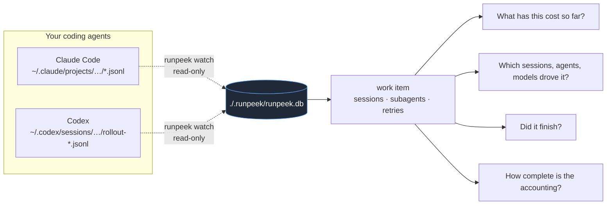

> **0.3 private pilot:** Run `runpeek init` for local setup, `runpeek collect` for a shared-work report,
> and use the metadata-only orchestration SDK for your own agents. Optional self-hosted device sync
> is available; no hosted service or universal browser-platform integration is configured.
> See [shared accounting setup and security boundaries](docs/UNIFIED.md).

<div align="center">

# RunPeek

**by NemulAI**

*See where your coding agents spend money, and what a piece of work actually took.*

[](https://pypi.org/project/runpeek/)
[](https://github.com/AgentMulder404/runpeek/actions/workflows/ci.yml)
[](pyproject.toml)
[](LICENSE)
[](pyproject.toml)

</div>

RunPeek reads the session records your coding agents already write, groups
them into **work items** (a task, a feature, a bug fix, a deployment), and
tells you what each one cost in model usage: which sessions, agents and
models drove it, whether the work finished, and how much of the accounting
it can actually vouch for.

No account. No service. No uploads. No runtime dependencies. One SQLite file
per project.

```
pip install --pre runpeek
```

---

## The questions it answers



| Question | Where the answer comes from |
|---|---|
| **What has this work cost so far?** | Every model call in the assigned sessions, priced with a dated list-price rate card. Shown as an *API-equivalent estimate of model usage*, never as a bill. |
| **Which sessions, agents and models drove that cost?** | Breakdowns by agent (Claude Code, Codex), by model, by session, with subagents shown under their parent, plus a spending timeline. |
| **Did the work finish?** | The work item's outcome: completed, incomplete, failed or abandoned. |
| **How complete and trustworthy is the accounting?** | Priced subtotal versus total calls, unpriced models, missing usage, unsupported record versions, replayed usage from resumed sessions, and the rate card and calculation version behind every number. |

---

## Five-minute setup

```bash
pip install --pre runpeek                 # pre-release, so --pre
cd /path/to/project

runpeek watch --once                      # 1. collect Claude Code and Codex sessions for this project
runpeek sessions --unassigned             # 2. see what was collected

runpeek work new "Add export endpoint" --kind feature --repository "$PWD" --issue "#42"
runpeek work suggest wi-3f9a1c            # 3. sessions that match the repository or branch (nothing is assigned)
runpeek work assign wi-3f9a1c a1b2c3d4 01a078a0
runpeek work status wi-3f9a1c --outcome completed

runpeek work show wi-3f9a1c               # 4. the report
runpeek work show wi-3f9a1c --trace       #    … with the source usage records behind it
```

Leave `runpeek watch` running (without `--once`) while you work and it keeps
collecting. Everything goes to `./.runpeek/runpeek.db`; point commands
elsewhere with `--db`.

---

## A work-item report

Real output from the maintainer's machine (one feature worked on across a
Codex thread with two subagents and two Claude Code sessions with one
subagent; session ids shortened):

```
WORK ITEM wi-e312f4  ·  Multi-agent research pipeline  ·  feature
repository /Users/…/NemulAI · branch main
Outcome: completed (closed Today 22:09)
Created Today 22:09 · activity Sep 04 16:03 → Today 22:09

ESTIMATED MODEL COST
  $29.3278055  estimated model cost (API-equivalent, list prices)
  127 of 239 model calls priced · total is a priced subtotal, not the whole (112 unpriced, 0 without usage)
  tokens: input 1,165,089 · cache read 26,094,895 · cache write 852,609 · output 241,353 (reasoning 5,719)
  Model usage only, as reported in agent session records: not infrastructure, CI, hosting or
  provider billing. Not a subscription charge. Estimates use dated list-price rate cards.

BY AGENT
  Agent          Sessions   Calls     Est. cost   Share  Unpriced
  Claude Code           3     127   $29.3278055  100.0%
  Codex                 3     112           —+?    0.0%  112

BY MODEL
  Model                             Agent         Calls    Input  Cache r   Output     Est. cost
  claude-fable-5-1                  Claude Code     106     2.9k    13.5M   188.5k    $28.403603
  claude-opus-5                     Claude Code      21       42   921.4k       60    $0.9242025
  gpt-6-astra                       Codex           112     1.2M    11.7M    52.8k           —+?

BY SESSION  (3 assigned, 3 subagents included via parent)
  Started           Session       Agent         Calls  Tools Failed     Est. cost   Share  Notes
  Yesterday 22:46   fb1861c8      Claude Code      59     82      0  $15.81071575   53.9%
  Yesterday 22:25   cb03baab      Claude Code      47     78      1  $12.59288725   42.9%
  Yesterday 22:44   agent-a888b0  Claude Code      21     39      0    $0.9242025    3.2%  subagent of cb03baab
  Sep 04 16:03      01a06ea7      Codex            96     87      0           —+?       —
  Sep 06 14:30      01a078a0      Codex             7      6      0           —+?       —  subagent of 01a06ea7
  Sep 06 14:30      01a078a1      Codex             9      8      0           —+?       —  subagent of 01a06ea7

TIMELINE  (by day, local time)
  2026-09-04            14 calls            —+?
  2026-09-06            55 calls            —+?
  2026-09-09            68 calls    $9.52287925  ████████████
  2026-09-10            59 calls   $19.80492625  ████████████████████████

ACCOUNTING COVERAGE
  Sessions: 6 counted · 3 assigned explicitly · 3 subagents via parent
  Model calls: 127 priced · 112 unpriced · 0 without usage → coverage partial
    112 × model gpt-6-astra not in openai-list@2025-08-01
  4 repeated usage snapshots ignored (cumulative total unchanged; Codex).
  Not measured: sessions written by other tools or outside the watched locations; work done
  without an agent; infrastructure or billing.

PRICING PROVENANCE
  127 calls priced with anthropic-list@2026-09-09 (effective at execution)
  Calculation version 1. Source-reported cost: not available in agent records.
  Every estimate row carries its usage id, request id (when the source has one), rate card and
  calculation version: runpeek work show --trace / runpeek export.
```

The 112 unpriced Codex calls are honest, not a bug: they ran on `gpt-6-astra`
before the date that model's price was verified, and RunPeek does not
backdate prices. `runpeek work show wi-e312f4 --pin openai-list@2026-09-10`
prices them under today's card for that view only and says so in the header.

---

## What the accounting guarantees

| Rule | What it means in the output |
|---|---|
| **Unknown stays unknown** | A call with no usage, an unknown model, or a record the adapter cannot read is counted and shown as unpriced. Never `$0`. The headline is a *priced subtotal* whenever anything is missing. |
| **Nothing is counted twice** | A session belongs to at most one work item. Subagents follow their parent unless assigned elsewhere. Re-importing the same records changes nothing. A resumed or forked transcript that replays old usage is counted once and the replay is reported. |
| **Estimate, not bill** | Every figure is labelled "estimated model cost (API-equivalent, list prices)". Subscription usage is never shown as a per-call charge. Infrastructure, CI and hosting are outside scope and the report says so. |
| **Prices are verified and dated** | Rate cards record their source URL and retrieval date. A model is priced only from the date its price was verified; earlier usage stays unpriced under the card effective then. |
| **Every number is traceable** | Each usage row keeps its source ids (message id, response id, ordinal), the rate card and resolution used, and the calculation version. `--trace` and `runpeek export` expose them. |
| **Assignment is explicit** | Repository, branch and issue only *suggest* sessions. Nothing joins a work item without a command. |

---

## Supported agents

| Agent | Records read | Status | What was verified |
|---|---|---|---|
| **Claude Code** 2.1.x | `~/.claude/projects/<project>/*.jsonl` and `…/<session>/subagents/*.jsonl` | 🧪 Supported, experimental (undocumented format, version-gated) | Per-request usage keyed by message id; subagent files share no usage with their parent (0 overlaps in 11,090 ids); forked sessions replay old ids (268 found), counted once |
| **Codex** CLI 0.130–0.153 | `~/.codex/sessions/YYYY/MM/DD/rollout-*.jsonl` | 🧪 Supported, experimental (undocumented format, version-gated) | Usage taken as the difference of consecutive cumulative totals; summing `last_token_usage` over-counts (112 stale repeats in 3,847 events); subagent counters restart at zero; identity from the file's thread id |
| Cursor, Gemini CLI, Aider, others | — | ❌ Not supported | see roadmap |

Both adapters read the agents' own files, read-only, and store only ids,
timestamps, tool names, allowlisted targets, token counts and model names.
Details and evidence: [`docs/AGENT_SOURCES.md`](docs/AGENT_SOURCES.md).

Rate cards shipped: `anthropic-list@2026-09-09`, `openai-list@2026-09-10`
(and the earlier OpenAI cards they supersede). Verification log in
[`docs/PRICING.md`](docs/PRICING.md). Add your own with `--rate-card FILE`.

---

## Command reference

| Command | What it does |
|---|---|
| `runpeek watch [--once] [--source all\|claude-code\|codex]` | Collect sessions for the project (or `--all-projects`); live feed of turns and potential inefficiencies |
| `runpeek work new NAME --kind task\|feature\|bugfix\|deployment` | Create a work item (`--repository`, `--issue`, `--branch`, `--pr`, `--deployment`, `--note`) |
| `runpeek work list [--open]` | Work items with sessions, calls and estimated cost |
| `runpeek work show ID [--trace N] [--pin CARD]` | The cost report |
| `runpeek work assign ID SESSION…` / `unassign SESSION…` | Explicit assignment; reassignment is recorded |
| `runpeek work status ID --outcome completed\|incomplete\|failed\|abandoned` | Close with an outcome (`--status open` reopens) |
| `runpeek work suggest ID` | Unassigned sessions matching the item's repository or branch. Assigns nothing |
| `runpeek work edit ID …` | Change name, kind or references |
| `runpeek sessions [--unassigned] [--detailed]` | Collected sessions with agent and work item |
| `runpeek session ID` | One session: turns, tools, usage, estimate, work item, findings |
| `runpeek findings` | Repeated failures, repeated reads and tight loops, with evidence |
| `runpeek export --out FILE` | Every stored table as JSONL |

Session and work-item ids accept unique prefixes.

---

## Also: observe your own Python application

`runpeek run python app.py` wraps the OpenAI Python SDK's
`chat.completions.create` (synchronous, non-streaming) in your own code,
attributes calls to customers and jobs with `runpeek.job(...)`, and prints a
summary. It is a separate accounting domain from agent sessions and is never
mixed into a work item.

```python
import runpeek

with runpeek.job(customer="acme", job="support_ticket"):
    client.chat.completions.create(...)
```

`runpeek summary`, `events`, `export` and `reprice --pin CARD` work on those
runs. Streaming calls are observed but not measured; `AsyncOpenAI` and the
Responses API are not patched. Offline demo: `runpeek run python examples/basic.py`.

---

## Privacy and local storage

| Stored | Never stored |
|---|---|
| ids, timestamps, tool names, exit-code-derived error flags | prompts, completions, reasoning |
| relative paths, program names, hostnames, branch names | tool inputs and outputs, commands, patches, file contents |
| token counts, model names, response ids | credentials, commit hashes, instructions |
| work item names and references you type | — |

One SQLite file, created `0600`. [`docs/PRIVACY.md`](docs/PRIVACY.md).

## Known limitations

- Two agents. Both formats are undocumented and version-gated; other versions
  are parsed best-effort and flagged in every report.
- Prices are list prices verified on a date. Contract rates need your own
  card. Usage before a model's verification date is unpriced by design.
- Only Edit/Write and patch tool calls count as an observed change; command
  side effects are invisible to the diagnostics.
- Codex tool errors are known only when the output carries an exit code or
  an MCP item failed; otherwise the flag is NULL, not "success".
- Nothing here is infrastructure cost or provider billing.

## Roadmap

Not implemented, deliberately: evidence-backed explanations of repeated
failures and expensive calls; inferred work categories (research,
implementation, testing, debugging) with user corrections; budgets and
alerts; forecasts from comparable completed work; more agent adapters;
infrastructure costs and billing reconciliation.

## Development

```bash
pip install -e ".[dev]"
pytest                          # 125 tests, offline; sanitised real Codex records in tests/fixtures/codex
ruff check src tests examples
mypy                            # strict
python -m build
```

## Migration from the NemulAI harness

`runpeek` replaces `nemulai` for the CLI and import; `RUNPEEK_*` replaces
`NEMULAI_*` (legacy names still honoured); an existing `./.nemulai/nemulai.db`
is used in place. [`docs/MIGRATION.md`](docs/MIGRATION.md).

## Contributing and license

[`CONTRIBUTING.md`](CONTRIBUTING.md) · [`SECURITY.md`](SECURITY.md) ·
Apache License 2.0, see [`LICENSE`](LICENSE) and [`NOTICE`](NOTICE).
