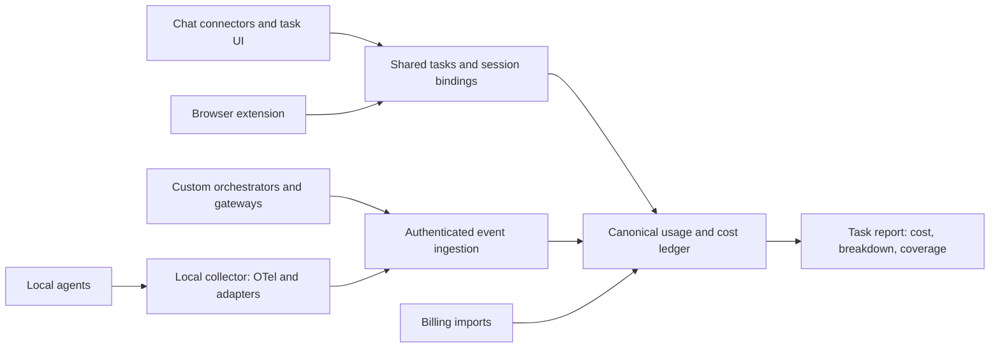

# RunPeek cross-platform engineering plan

Status (2026-09-11): Phase 0 capability probes done for Claude Code and Codex with
real sessions (`docs/EVIDENCE_MATRIX.md`); Gemini CLI and browser connectors are
documented but unverified. Phase 1 vertical slice implemented in 0.4.0a1: local
telemetry receiver, reversible agent connectors, MCP task tools, browser
conversations as unmetered participants, `runpeek setup`. Remote MCP/OAuth,
signed installer, hosted sync and billing imports are not built.

## Product contract

A user connects RunPeek, creates a task such as “Build login,” and attaches conversations, coding sessions, orchestrator runs, and deployment jobs to it. RunPeek shows where the work happened, its measured usage, its attributed cost, and any missing coverage. Setup must not require cloning a repository, creating a virtual environment, or editing configuration files manually.

The shared task is the organizing unit. Tokens, costs, outcomes, and coverage are separate measurements. An arbitrary efficiency score would hide the uncertainty we need to expose.

Connecting an MCP server enables interaction with RunPeek. It does not, by itself, establish that RunPeek receives the host's model usage. Every supported integration must demonstrate its collection mechanism with a real session.

## Existing solutions and lessons

| Precedent | Documented mechanism | RunPeek decision |
| --- | --- | --- |
| [Claude Code monitoring](https://code.claude.com/docs/en/monitoring-usage) | Opt-in OpenTelemetry usage events and metrics | Prefer native telemetry; strip content and identity fields locally |
| [Codex telemetry](https://learn.chatgpt.com/docs/config-file/config-advanced#observability-and-telemetry) | Opt-in OTel events, including token counts on response completion | Test each client/version; do not assume CLI support proves every desktop/cloud surface |
| [Gemini CLI telemetry](https://geminicli.com/docs/cli/telemetry/) | OTel token usage and tracing | Add an adapter to the same collector; disable content capture |
| [Langfuse MCP tracing](https://langfuse.com/docs/observability/features/mcp-tracing) | Propagates trace context through MCP metadata between instrumented participants | Reuse trace propagation; it does not instrument an opaque host automatically |
| [LiteLLM spend tracking](https://docs.litellm.ai/docs/proxy/cost_tracking) | Gateway records requests and calculates usage cost | Integrate existing gateways for custom orchestrators; retain pricing provenance and reconcile bills |
| [Helicone](https://docs.helicone.ai/quick-start) | Gateway-based observability | Another import/integration target, not a reason to build a new proxy first |
| [ccusage](https://github.com/ccusage/ccusage) | Local usage reporting from agent data | Keep log adapters as compatibility/backfill paths, with fixtures and version checks |
| [Anthropic desktop extensions](https://www.anthropic.com/engineering/desktop-extensions) | Packaged MCP installation | Use supported packaging to eliminate developer setup steps where available |

These sources establish useful component solutions. They do not establish universal access to native consumer-chat inference accounting.

## Architecture

### 1. Shared task service and MCP interface

Expose a small tool surface: create/find task, attach a source session, and retrieve a compact report. Serve the same API to a normal web UI so checking a number need not invoke a model. Use official MCP SDKs and production OAuth, not the pilot's operator-driven device approval as the final onboarding system.

An integration capability record states whether it supports binding, token measurement, pricing, billing reconciliation, and outcome evidence. “Connected” and “Collecting usage” must be different states.

Official [ChatGPT MCP server guidance](https://developers.openai.com/plugins/build/mcp-server) and [authentication guidance](https://developers.openai.com/plugins/build/auth) provide the connector building blocks. App availability, account policies, and distribution requirements must be verified per host before publishing an installation promise.

### 2. Local collector packaged as an application

Ship a signed, self-contained application, initially for macOS. It discovers supported agent configurations, shows the exact sources to enable, and applies reversible changes after user selection. Preserve existing exporters: detect conflicts and offer forwarding or a separate integration rather than overwriting them.

Receive native telemetry on an authenticated local endpoint; normalize and allowlist fields before persistence or upload. Use existing log readers for historical import and clients without suitable telemetry. Keep offsets and a bounded durable queue; resume after restarts and network failures.

Validate whether a host extension can package and manage the collector lifecycle reliably. A helper that dies whenever a chat app closes is insufficient for background tracking; use an independently installed service when needed. Remote MCP cannot silently install a local service.

### 3. Browser bridge: first-class feasibility work

Provide a browser extension that lets the user attach the current conversation to a task. Start with user-triggered site access and store opaque conversation identifiers. Chrome's [activeTab](https://developer.chrome.com/docs/extensions/develop/concepts/activeTab) supplies temporary access after a user action; persistent monitoring would need separately disclosed site permissions. [Native messaging](https://developer.chrome.com/docs/extensions/develop/concepts/native-messaging) can connect an extension to an installed helper.

Prototype these paths independently:

1. Remote connector: create/attach tasks and display reports. Test whether the host supplies a stable conversation identity; otherwise use an explicit binding link/code. Never assume MCP transport session identity equals chat identity.
2. Browser extension: attach the conversation and record minimal, consented activity metadata. Test navigation, forks, regenerated answers, multiple tabs, and expired sessions. Do not read message bodies by default.
3. Official account/admin exports: investigate usage and billing access for each supported account type. Record available granularity and permissions. Account-level totals do not become conversation-level actuals through inference.
4. Optional controlled execution: a connector can launch work through an instrumented runner and track that delegated workload. This requires a separate execution/security design and potentially API charges; it does not meter the host's native subscription conversation.

If no reliable native token source exists for a surface, it participates in the task as unmetered activity. A visible-text token estimate, if later offered with consent, must remain separate from provider token usage: it misses hidden context, caching, reasoning, and internal calls. Avoid cookie extraction, TLS interception, or private endpoint scraping as the product foundation.

### 4. Orchestrator and deployment integration

Accept OTLP plus a small versioned event API. Supply Python and TypeScript helpers for task/run context; propagate W3C trace context and task identity across subprocesses, queues, retries, and MCP calls where participants support it. Import from established gateways instead of requiring customers to replace their stack.

Capture model request attempts, including retries and unsuccessful requests when usage is reported. Link CI jobs and deployment IDs as outcome evidence. Infrastructure charges require their own billing source; a successful deployment event does not reveal hosting cost. Local model usage can expose tokens/time while electricity or hardware allocation remains a separate optional cost model.

## Attribution and accounting

Bind `(workspace, integration, source-session, effective interval)` to a task. Avoid one global active task: two tabs and two agents may be doing different work simultaneously. Child runs inherit task identity when explicitly propagated; ambiguous imported history stays unassigned until corrected. Repository or timing similarity may suggest an assignment but must not silently establish it.

Separate observations, logical requests, charge attempts, and allocations. A single charge can have several observations from telemetry, logs, gateway, and billing. Prefer stable provider/account/request IDs. Where these are absent, designate an authoritative collector per source and quarantine suspected overlaps; matching timestamps alone cannot prove duplication. Aggregate counters need reset/delta handling and must not be added to request events covering the same activity.

Keep raw reported token categories and adapter semantics. Normalize cached/reasoning categories without double counting subsets. Store price version, currency, service tier, and effective date. Use decimal arithmetic. Unknown models stay unpriced. Corrections are auditable and reports are reproducible as of a given time.

Present distinct amounts:

- Billed charges matched to this task.
- Provisional cost from measured usage where no matching billed charge exists.
- Optional allocated subscription/infrastructure cost under an explicit allocation rule.
- Unmetered activity and unassigned spend.

A provisional task total may combine the first three only when their categories do not overlap, with its composition visible. API-equivalent subscription usage must not be added to the subscription allocation. Invoice reconciliation often works at account/day granularity; leave unmatched differences there rather than pretending exact task attribution.

Example report: “Login: $8.40 attributed so far — $6.10 billed, $1.30 provisional API usage, $1.00 allocated subscription. Two browser conversations have no measured tokens.” These are illustrative numbers. Coverage is known-source coverage, not a claim to know the percentage of all hidden work.

## Security and operating overhead

Use OAuth with PKCE and resource/audience validation for user connections; separate scoped collector credentials from user report/admin credentials. Derive tenant scope from authenticated identity. Validate workspace access on every read, write, and source binding; model-supplied task IDs are not authorization.

Keep provider secrets in OS credential storage or a managed server secret store. Encrypt transport, storage, and backups. Apply retention/deletion to replicas, exports, and backups with a documented expiry policy. Test revocation, replay, cross-tenant access, malicious URLs, oversized payloads, and prompt-injected tool requests. Local endpoints need origin/auth checks and must not accept arbitrary filesystem paths from web callers.

Only allowlisted usage metadata leaves the collector. Reject prompt text, tool arguments, output snippets, email addresses, and raw paths; built-in vendor redaction is insufficient by itself. Never enable full traces just to count tokens. Sign application updates and dependency artifacts; constrain ingestion resources and pricing updates.

Collection, normalization, matching, pricing, and scheduled summaries use ordinary code, not model calls. MCP tool definitions and report requests can still consume host tokens: keep tools small, return compact summaries, paginate detail, and offer direct UI access. No per-turn “report your usage” tool calls.

Initial performance targets to validate: zero collector-initiated model calls; under 1% idle CPU averaged over ten minutes; under 100 MB collector RSS; p95 enqueue under 5 ms on stated hardware; routine reports under 500 words. Measure actual network volume and host context overhead. Mark queue overflow and collection gaps visibly; never silently drop data to meet a benchmark.

## Delivery order and release gates

### Phase 0 — prove the hard parts

Build throwaway integration probes before extending the production schema. Test real Claude Code, Codex, Gemini CLI, ChatGPT browser, and Claude browser sessions, documenting exact client/account versions. Produce a capability matrix and sanitized fixtures. Compare emitted usage with native usage views where comparable. Establish browser identity and metering boundaries, including what requires an extension or admin account.

Gate: a recorded cross-platform task walkthrough with measured versus unmetered segments explicitly shown. Decide whether the product contract is acceptable before claiming universal accounting.

### Phase 1 — eliminate setup friction

Build the installer, source discovery, OAuth connector, task picker, and collection health screen. Start a new task from any supported interface. Allow session binding without opening a terminal. Support clean uninstall and restoration of configuration changes.

Gate: five fresh testers on machines without the repository or Python complete installation and see a real collected event without assistance; target median under three minutes. Test permitted account types separately. No “connected successfully” screen when collection is actually unavailable.

### Phase 2 — trustworthy shared totals

Add native telemetry adapters, session bindings, event provenance, reconciliation, and a basic task report. Include concurrent tasks, nested agents, log/telemetry overlap, streaming interruptions, retries, late events, offline replay, rotations, clock skew, counter resets, and deletion replay in acceptance fixtures.

Gate: deterministic expected totals for all fixtures, no duplicate charges on replay, no silent cross-task attribution, and visible gaps when collection fails.

### Phase 3 — broader workflows and outcomes

Add OTLP/custom orchestration guides, a gateway import, CI/deployment links, and account billing imports supported by the Phase 0 findings. Bring browser task participation into the same user journey. Budget alerts are observational; hard enforcement is offered only on execution paths RunPeek controls.

Gate: a real feature spans browser planning, two coding agents, a child orchestrator run, and deployment, with one report and a traceable explanation for every included dollar.

### Phase 4 — production release

Complete tenant-isolation testing, external security review, backup/restore and deletion verification, signed distribution, support policy, and compatibility monitoring. Expand operating systems only after their installer and permission flows pass the same fresh-user gate.

## Relationship to the existing repository

The previous implementation reports useful ledger, sync, collection, and recovery foundations. Re-audit those modules against this contract before reuse; prior unit-test success is not evidence of universal coverage or production readiness. Extend task bindings and evidence semantics before adapting the old CLI flow. The private hub is a prototype to harden or replace behind a production service, not a public launch candidate merely because it runs.

Build next: Phase 0 probes and the fresh-user installation prototype. Defer a large dashboard, model-generated optimization advice, and a proprietary gateway until these gates demonstrate a product users can actually connect and trust.
